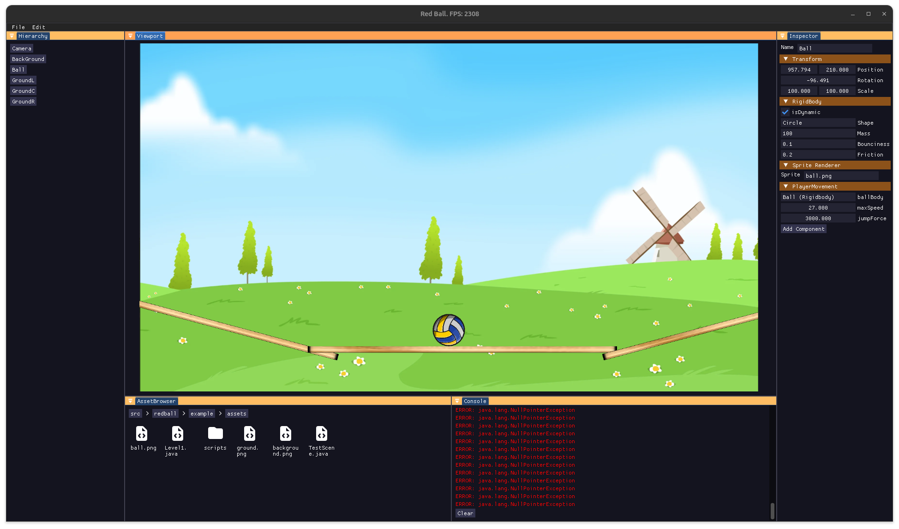

# RedBall Engine
> A 2D game engine being built from scratch in Java + OpenGL.<br>
> Actively in progress. Things will break. Things will change. That's the point.

  

---

## Current State

> Live inspector, physics simulation, and a ball that rolls around.
> Not bad for a WIP.



---

## ✅ What's Done

- [x] **OpenGL Renderer** — GLSL shaders, sprite rendering pipeline
- [x] **Batch Rendering** — All sprites drawn in a single draw call
- [x] **Entity-Component System (ECS)** — Entities composed of modular components
- [x] **Add Component Menu** — Searchable dropdown to attach components at runtime
- [x] **Custom Component Scripts** — Write your own components, they show up in the engine automatically

---

## 🚧 In Progress

- [ ] **Editor** — Runtime panel to view & edit entity properties, currently features project hierarchy and inspector
- [ ] **Scene Save / Load** — Serialize and deserialize scenes to disk
- [ ] **Collision Callbacks** — `onCollisionEnter`, `onCollisionExit` events

---

## 💭 Planned / Ideas

- [ ] **Tilemap Support** — Lay out levels with tiles
- [ ] Particle system
- [ ] Animation system (sprite sheets)
- [ ] Level editor improvements
- [ ] Packaging / export to standalone JAR

---

## 🗂️ Project Structure

```
RedBall/
├── src/redball/        # Engine source (Java)
├── src/redball/scenes  # Example game scenes
├── shaders/            # GLSL vertex & fragment shaders
├── resources/          # Sprites and assets
└── lib/                # LWJGL and other deps
```

---

## 🧩 Writing a Custom Component

One of the core features, you can add your own logic as a component and it'll automatically appear in the **Add Component** menu inside the engine.

```java
public class MyComponent extends Component {
    public float speed = 5.0f;

    @Override
    public void start() {
        // runs once on scene start
    }

    @Override
    public void update(float dt) {
        // runs every frame
    }
}
```

---

## 🛠️ Stack

| Layer | Tech |
|---|---|
| Language | Java |
| Rendering | OpenGL via LWJGL |
| Shaders | GLSL |
| GUI | [ImGui](https://github.com/SpaiR/imgui-java) |

---

## 🚀 Running It

1. Clone the repo
   ```bash
   git clone https://github.com/Abhineet1144/RedBall.git
   ```
2. Open in IntelliJ IDEA
3. Make sure `lib/` is on the classpath
4. Run the main class

---

> **Note:** This engine is a learning/passion project. It's not production-ready and the API will change as I figure things out. Contributions and feedback are welcome though!

*— [@Abhineet1144](https://github.com/Abhineet1144) & [@tejzs](https://github.com/Tejzs)*